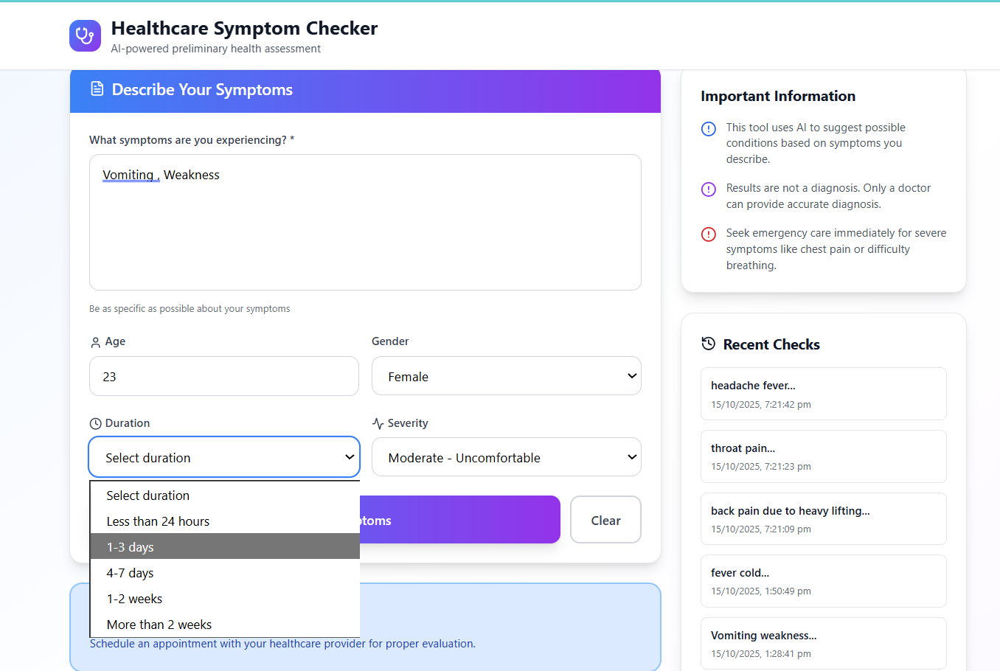
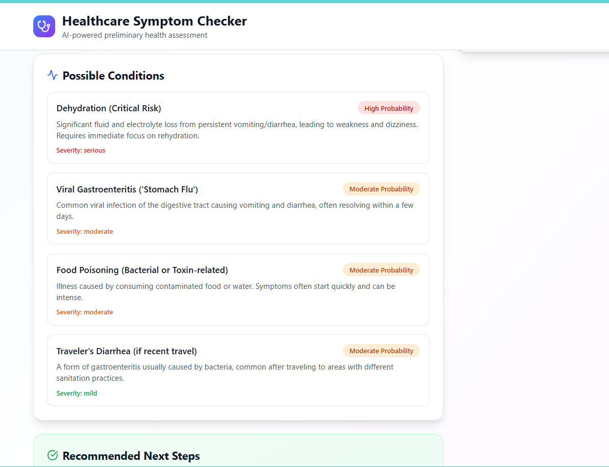
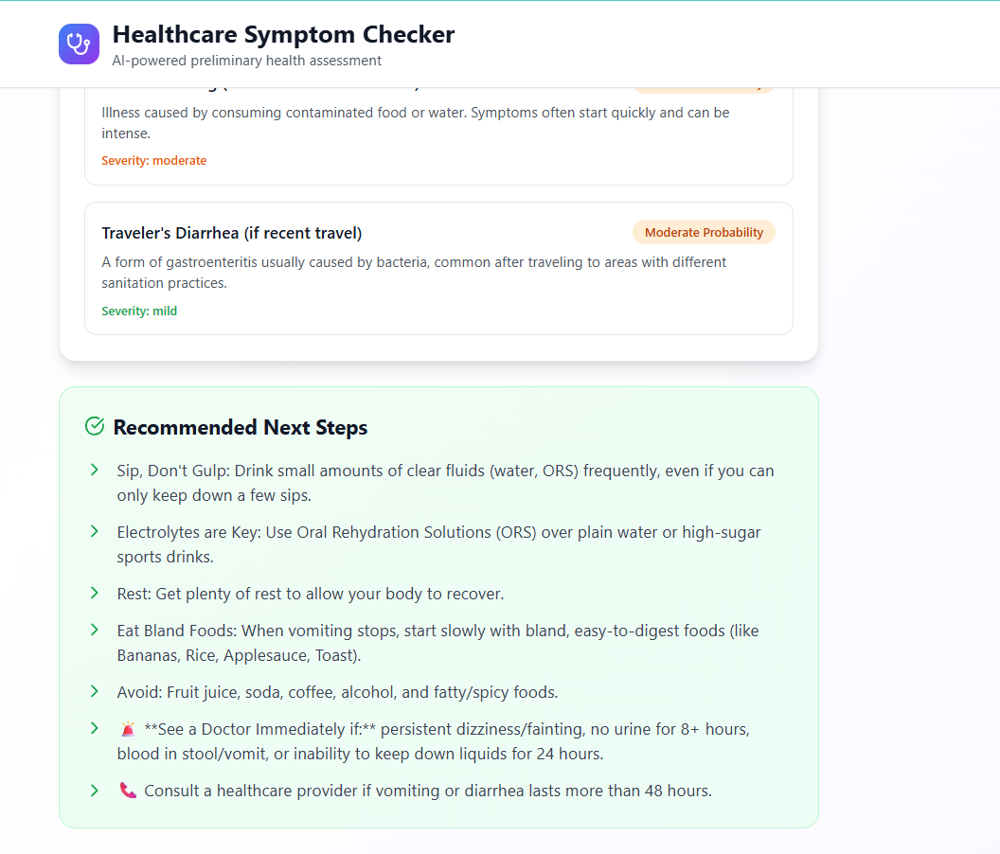

#  Healthcare Symptom Checker

**AI-Powered Preliminary Health Assessment System**

A modern, full-stack healthcare symptom checker that uses Large Language Models (LLMs) to provide educational preliminary assessments of symptoms. Built with React, Flask, and Gemini AI integration.
---
## DEMO VIDEO
- https://drive.google.com/file/d/1AxKEP62fTz3s8aGaLZ1pkLwLZxwhR-xh/view?usp=sharing
---
[](https://opensource.org/licenses/MIT)
[](https://www.python.org/downloads/)
[](https://reactjs.org/)

---

## Medical Disclaimer

**THIS IS FOR EDUCATIONAL PURPOSES ONLY**

This application does NOT provide medical advice, diagnosis, or treatment. It is designed for educational and informational purposes only. Always consult with a qualified healthcare professional for medical concerns. In case of emergency, call your local emergency services immediately.

---

##  Features

- **AI-Powered Analysis**: Uses Gemini/GPT to analyze symptoms intelligently
- **Comprehensive Input Form**: Collects symptoms, age, gender, duration, and severity
- **Smart Recommendations**: Provides condition possibilities and next steps
- **Urgency Classification**: Categorizes cases as urgent, soon, or routine
- **Query History**: Tracks past symptom checks (stored securely)
- **Rate Limiting**: Prevents abuse with API rate limits
- **Modern UI**: Beautiful, responsive React interface
- **Safety First**: Multiple disclaimers and warnings for user safety

---

##  Architecture

```
symptom-checker/
├── frontend/                 # React Application
│   ├── src/
│   │   ├── components/
│   │   │   └── SymptomChecker.jsx
│   │   ├── App.jsx
│   │   └── index.js
│   ├── package.json
│   └── README.md
│
├── backend/                  # Flask API Server
│   ├── app.py               # Main Flask application
│   ├── requirements.txt     # Python dependencies
│   ├── .env.example         # Environment variables template
│   └── symptom_checker.db   # SQLite database (auto-created)
│
├── tests/                  # Test files
│   ├── test_api.py
│  
├── .gitignore
├── README.md
└── demo-video.mp4          # Demo video
```
---

##  Quick Start

### Prerequisites

- Python 3.8 or higher
- Node.js 16 or higher
- npm or yarn
- Gemini API key or OpenAI API key

### Backend Setup

1. **Clone the repository**

2. **Create virtual environment**
```bash
python -m venv venv
source venv/bin/activate  # On Windows: venv\Scripts\activate
```

3. **Install dependencies**
```bash
pip install -r requirements.txt
```

4. **Set up environment variables**
```bash
cp .env.example .env
# Edit .env and add your API keys
```

5. **Run the Flask server**
```bash
python app.py
```

Server will start at `http://localhost:5000`

### Frontend Setup

1. **Navigate to frontend directory**
```bash
cd ../frontend
```

2. **Install dependencies**
```bash
npm install
```

3. **Create environment file**
```bash
echo "REACT_APP_API_URL=http://localhost:5000" > .env
```

4. **Start development server**
```bash
npm start
```

Frontend will open at `http://localhost:3000`

---

##  Screenshots








---
##  Contributing

1. Fork the repository
2. Create feature branch (`git checkout -b feature/AmazingFeature`)
3. Commit changes (`git commit -m 'Add AmazingFeature'`)
4. Push to branch (`git push origin feature/AmazingFeature`)
5. Open Pull Request

---

##  Authors

- https://github.com/Kajalmeshram11

---
